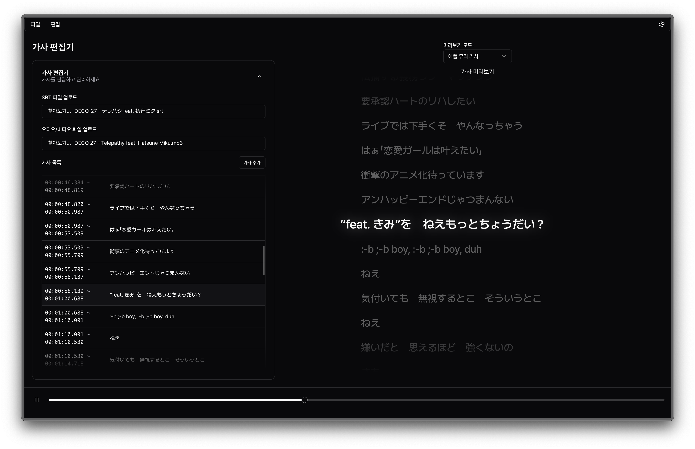

# Lylvey - 실시간 가사 에디터

실시간으로 음악이나 비디오의 가사를 편집하고 관리할 수 있는 웹 애플리케이션입니다.

## 주요 기능

- 음악/비디오 파일 재생 및 가사 동기화
- 실시간 가사 편집 및 타임라인 관리
- SRT 파일 가져오기/내보내기
- 애플 뮤직 스타일의 가사 미리보기
- 자막 스타일의 가사 미리보기
- 실행 취소/다시 실행 기능
- 다크 모드 지원

## 기술 스택

- Next.js 14
- React 18
- TypeScript
- Tailwind CSS
- shadcn/ui

## 개발 환경 설정

```bash
# 저장소 복제
git clone <repository-url>
cd lylvey

# 의존성 설치
npm install

# 개발 서버 실행
npm run dev
```

## 배포 방법

### Vercel 배포 (권장)

1. [Vercel](https://vercel.com)에 가입하고 GitHub 계정을 연동합니다.
2. "New Project" 버튼을 클릭합니다.
3. 이 저장소를 선택하고 "Import"를 클릭합니다.
4. 기본 설정을 유지하고 "Deploy"를 클릭합니다.

### Cloudflare Pages 배포

1. [Cloudflare Pages](https://pages.cloudflare.com/)에 가입합니다.
2. "Create a project" 버튼을 클릭합니다.
3. GitHub 계정을 연동하고 이 저장소를 선택합니다.
4. 다음 설정을 입력합니다:
   - Framework preset: Next.js
   - Build command: `npm run build`
   - Build output directory: `.next`
5. "Save and Deploy"를 클릭합니다.

## 환경 요구사항

- Node.js 18.17 이상
- npm 9.0.0 이상

## 라이선스

MIT License


